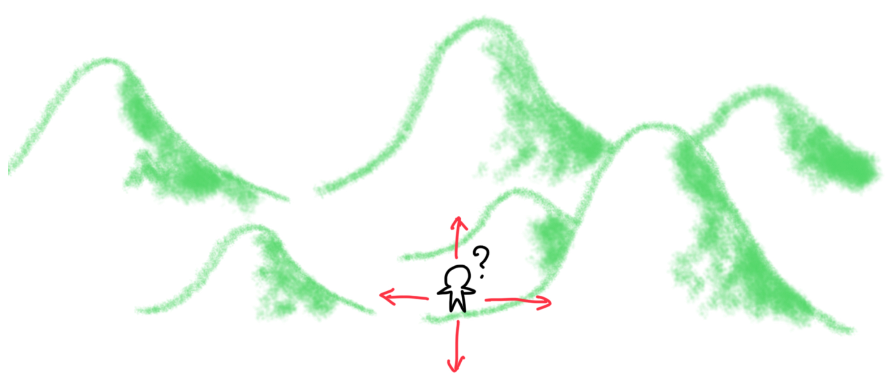
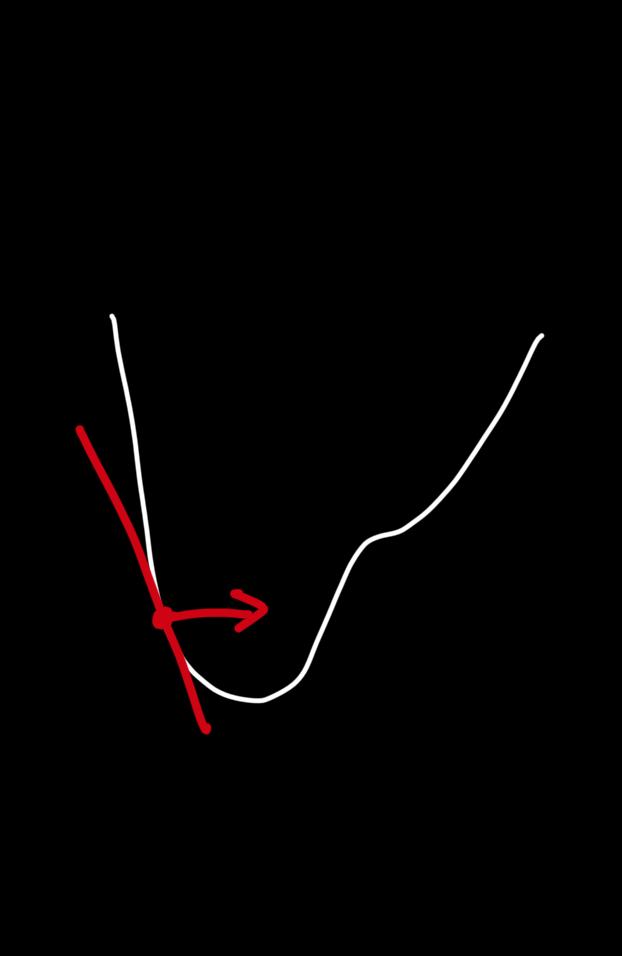
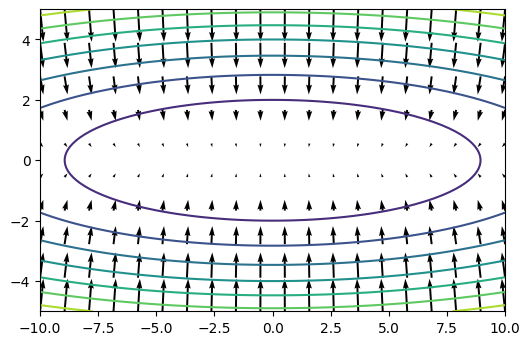

<!--
headingDivider: 1
_class: title
_paginate: false
-->

# パラメータの最適化

<a style="color:white; text-decoration: none;" href="https://github.com/kentakom1213">ぱうえる（けんた）:link:</a>

# パラメータとは

- 結果に影響を与える変数のこと
- ニューラルネットワークには、膨大な数のパラメータが存在する
  - 各層の重み
  - 各層のバイアス

これらをどのように修正していけば、損失関数の値を最小にできる？

# パラメータの最適化
- 頂上に辿り着くため、あなたはどこに向かうべき？

# 今までの方法(SGD)

確率的勾配降下法
（Stochastic Gradient Decent）
- パラメータをもとに勾配を求め、
  勾配が小さくなるように修正

$$
W \leftarrow W - \eta\frac{\partial L}{\partial W}
$$

# SGDの弱点

