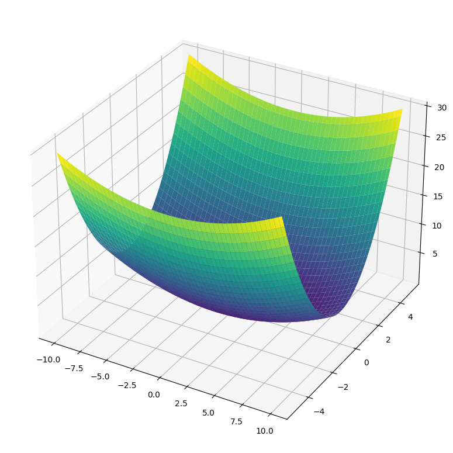
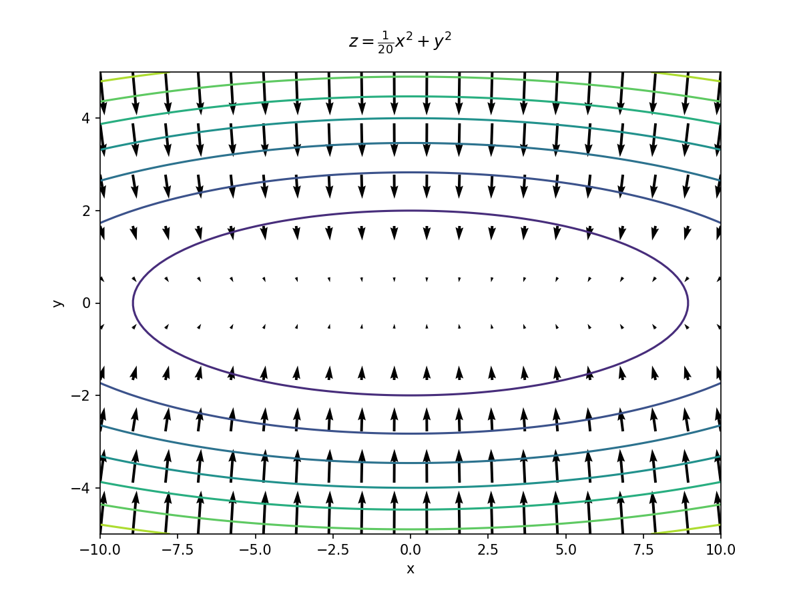
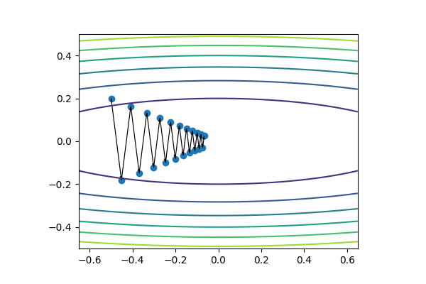

<!--
headingDivider: 2
_class: title
_paginate: false
-->

# パラメータの最適化

<a style="color:white; text-decoration: none;" href="https://github.com/kentakom1213">ぱうえる（けんた）:link:</a>

## パラメータとは

- 結果に影響を与える変数のこと
- ニューラルネットワークには、膨大な数のパラメータが存在する
  - 各層の重み
  - 各層のバイアス

これらをどのように修正していけば、損失関数の値を最小にできる？

## パラメータの最適化
- 頂上に辿り着くため、あなたはどこに向かうべき？

## 今までの方法(SGD)

確率的勾配降下法
（Stochastic Gradient Decent）
- パラメータをもとに勾配を求め、
  勾配が小さくなるように修正

$$
W \leftarrow W - \eta\frac{\partial L}{\partial W}
$$

## SGDの弱点

こんな感じのフィールドを考えてみよう

$$
z = \frac{1}{20}x^2 + y^2
$$

## SGDの弱点

勾配はこんな感じ

- x軸の勾配→小
- y軸の勾配→大

→どんな動き？

## SGDの弱点

こんな動き！

y軸の勾配が大きいため、無駄な動きをしている

## 試してみよう！

`optimization.ipynb`を使ってビジュアライズします:clap:

- **visualizer.Field**
  - 勾配を持ったフィールドです
  - フィールドのプロットもできます
- **visualizer.Adventurer**
  - 実際に動く人
  - たどったルートを記録します

## 対策！
