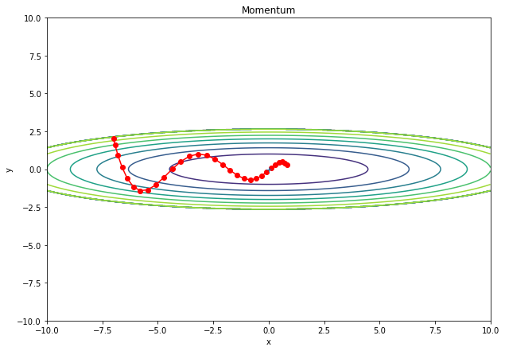
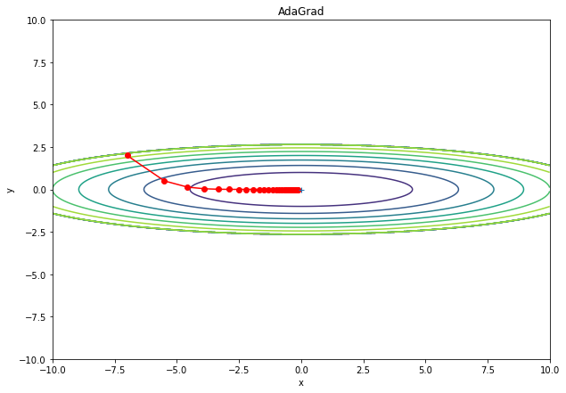
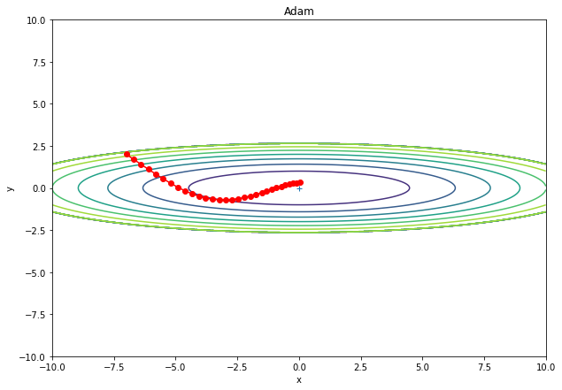
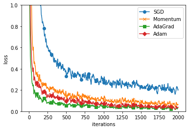

<!--
_class: title
_paginate: false
-->

# パラメータの最適化手法

### mono

---

## 学習係数

- 大きすぎると発散して正しい学習が行えない
- 小さすぎると学習に時間がかかる
  

---

## AdaGrad

#### 学習係数の減衰

- 最初は学習係数を大きく、徐々に小さくして学習する
  - NN の学習ではよく使われる手法
  - パラメータ「全体」の学習係数を一括して下げる
- AdaGrad では一つ一つのパラメータに対して学習係数を調整する

---

## AdaGrad の更新方法

$$
h ← h+\frac{\partial L}{\partial W}\odot\frac{\partial L}{\partial W}
$$

$$
W ← W-η\frac{1}{\sqrt h}\frac{\partial L}{\partial W}
$$

- $\odot$：アダマール積(成分ごとの積)
- W：更新するパラメータ
- h：勾配の 2 乗の値を足していったもの

---

## AdaGrad の更新方法

- h はパラメータごとに勾配の 2 乗和を保存している
  - よく動いたパラメータの学習係数ほど小さくなる
- h は単調増加のため学習係数($η\frac{1}{\sqrt h}$)は小さくなる
  - 学習を進めると更新量が少なくなってほぼ 0 になってしまう
- RMSProp
  - $h ← βh+(1-β)\frac{\partial L}{\partial W}\odot\frac{\partial L}{\partial W}$
  - 新しい勾配の情報が大きく反映されるようにする
  - 「指数移動平均」とも呼ばれる

---

## AdaGrad の更新経路

---

## Adam

- Momentom と AdamGrad(RMSProp)を融合
- バイアス補正が行われている
  - 使われる勾配の値を調整
- 参考文献
  - https://arxiv.org/pdf/1412.6980.pdf
  - https://www.anarchive-beta.com/entry/2020/08/13/180000

---

## Adam の更新経路

---

## どの更新手法を用いるべき？

- 比較をしてみる
  - AdaGrad がよさそう
- 解く問題によって結果が変わる
- ハイパーパラメータ(学習係数)の設定値にもよる
- 多く使われている手法は？
  - 今でも SGD が多く使われている
  - 最近では Adam を好んで使っている人が多い

---

## MNIST データセットによる比較

- 各層 100 個の五層ニューラルネットワーク
- 活性関数：ReLU

---

## 結果

---

## 結果

- SGD よりも他の手法が速く学習できている
  - AdaGrad の学習が少し速く行われている
- 解く問題によって結果が変わる
- ハイパーパラメータ(学習係数)の設定値にもよる
- 一般に SGD よりも他の 3 つの手法の方が速く学習できる
  - 時には最終的な認識性能にも差が出る
